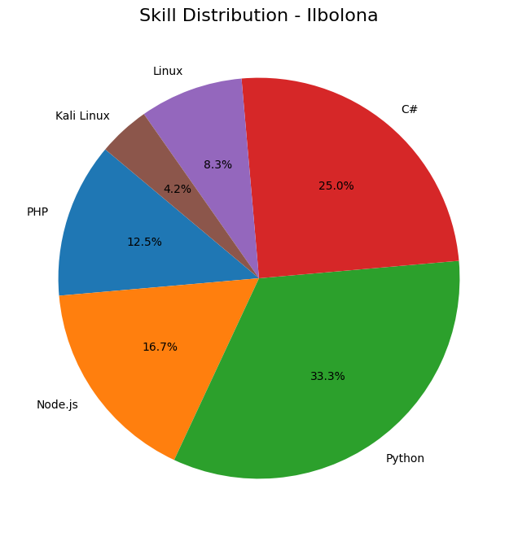

<h1 align="center">🎯 Hello, I'm Ilbolona 👋</h1>

배움에 끝은 없다. 끊임없이 성장하는 독학 개발자입니다.

---

### 🧑‍💻 About Me

- 🌱 **혼자서 코딩을 공부하며** 다양한 프로젝트를 경험한 풀스택 개발자
- 🌐 **웹부터 서버까지** 넘나들며 실전 감각을 쌓는 중
- 🛡️ **정보보안, 해킹, 서버, 네트워크** 등 시스템 전반에 관심 많음

---

### 📊 Skill Chart

  

- **PHP**: 30%  
- **Node.js**: 40%  
- **Python**: 80%  
- **C#**: 60%  
- **Linux**: 20%  
- **Kali Linux**: 10%  

---

### ⚡ Interests

- 🧠 **정보보안, 해킹, CTF** 문제 풀기
- 🐧 **Kali Linux & 서버 관리** 실전 경험 쌓기
- 🔐 **보안 설정 및 자동화**에 관심
- 💻 **CLI 기반 도구 개발** 즐김

---

> 💬 "계속 배우고 싶은 개발자, Ilbolona입니다." 🌱

  
  
  

